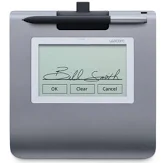
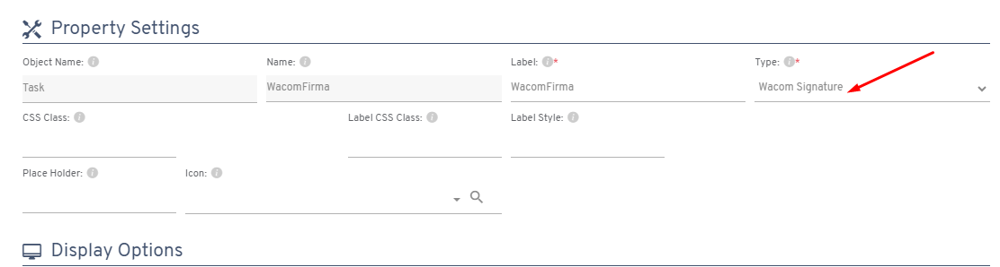
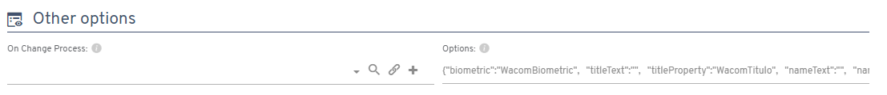
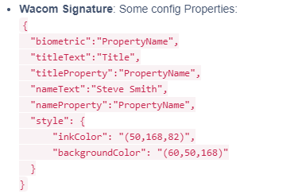
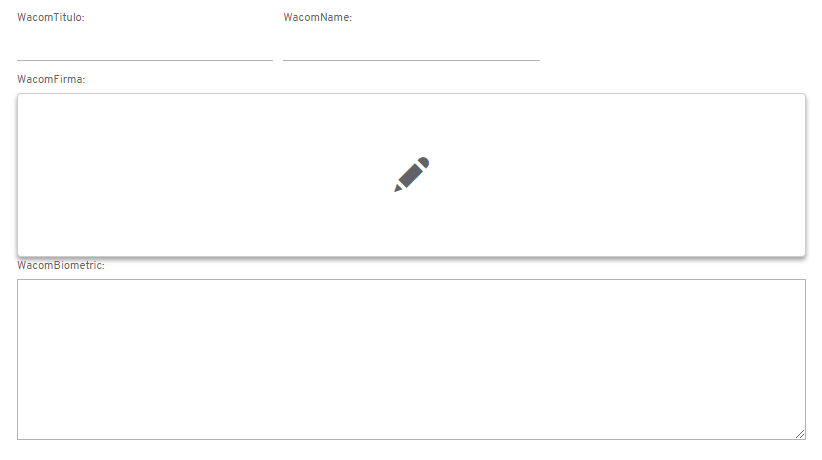
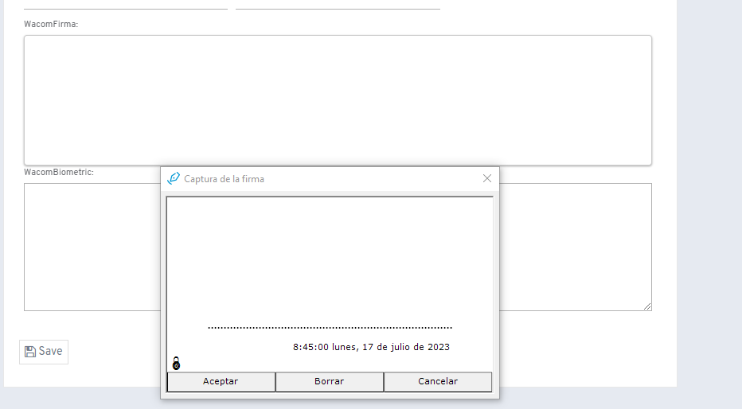
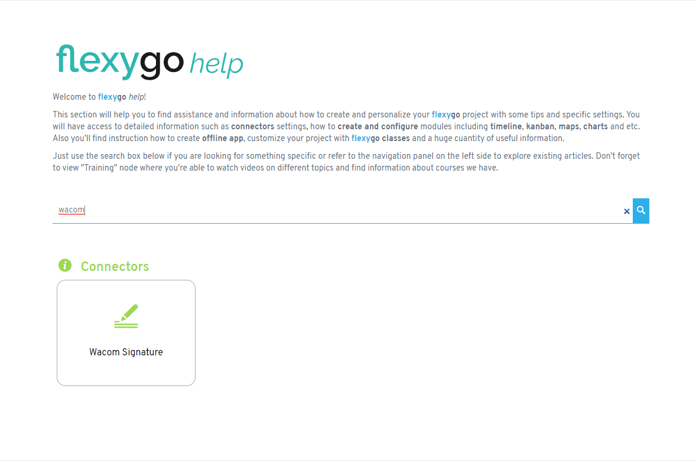

# ¿Sabías que Flexygo ha añadido un nuevo control para firmas integrado con las tabletas Wacom?

Flexygo ha desarrollado un nuevo tipo de control similar al WhiteBoard que permite trabajar con tabletas Wacom para captura de firmas.

## Características principales

**Configuración:**

* Nuevo tipo de control denominado **Wacom Signature**
* Se configura como propiedad de objeto o parámetro de proceso

* Disponible en la sección de Options

**Funcionalidades:**

El sistema permite guardar tanto la firma como los datos biométricos capturados mediante las tabletas Wacom, facilitando la integración de firmas digitales en los procesos de Flexygo.

