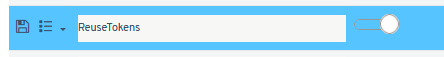

# ¿Sabías que puedes reutilizar los tokens de autorización de la WebAPI?

Por defecto, Flexygo genera un nuevo token en cada solicitud al endpoint `/token`. Sin embargo, existe la posibilidad de modificar este comportamiento.

## Solución

Para que el sistema devuelva el mismo código mientras permanezca válido, es necesario:

1. Acceder a los parámetros de la aplicación
2. Activar la opción **ReuseToken**

## Resultado

Una vez habilitada esta configuración, mientras un código siga "vivo" devolverá el mismo en todas las peticiones. Esto optimiza el funcionamiento al reutilizar tokens válidos en lugar de generar nuevos constantemente.

