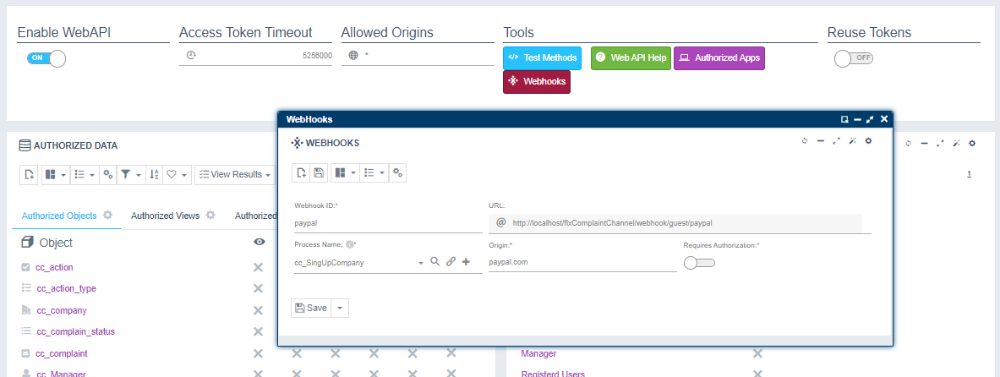

# ¿Sabías que Flexygo dispone de webhooks?

Flexygo puede recibir eventos de servicios externos independientemente de su protocolo de transmisión.

Esta funcionalidad permite una integración segura con servicios de terceros. Por ejemplo, podemos usarlo para recibir de forma segura la notificación de cuando un usuario finaliza un pago y comenzar con el envío de un pedido.

