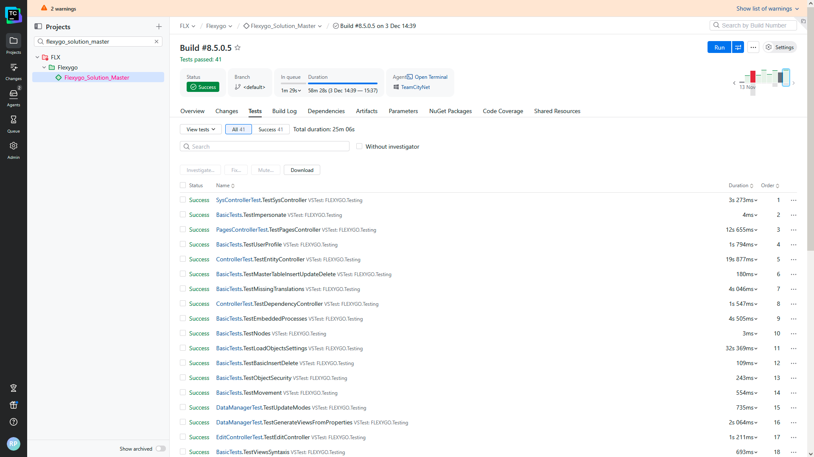
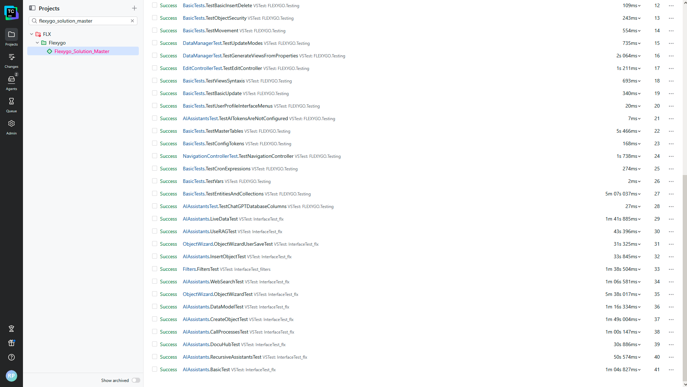
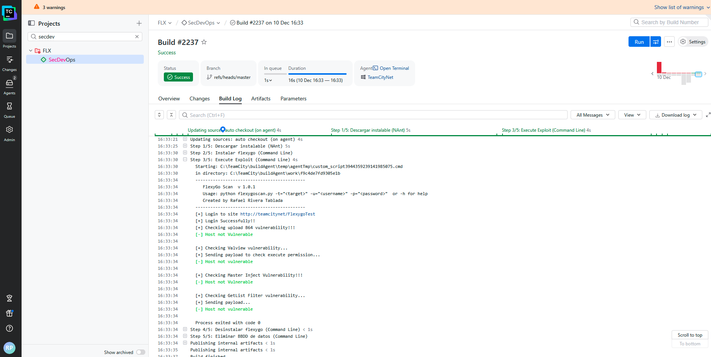

# Secure Development Lifecycle (SDLC)

## 1. Introduction

The Flexygo project implements a formally structured **Secure Development Lifecycle (SDLC)**, integrating security practices, quality control and traceability into every phase of the build, integration and deployment process.
The continuous integration (CI/CD) system documents and runs more than 30 automated steps that ensure the **integrity, availability and security of the software** at every stage of the development cycle.

The automation environment guarantees that every build follows a reproducible flow, with security controls, code analysis, unit tests, secure packaging and periodic artifact backups.

## 2. General flow of the applied SDLC

Flexygo's development process is structured into **sequential stages with dependencies conditioned on the success of the previous steps**, guaranteeing a secure, error-free flow before reaching the publishing environment.

**Main phases:**

1. Environment preparation and cleanup
2. Controlled code build
3. Secure dependency management
4. Validation and unit tests
5. Quality and coverage analysis
6. Artifact generation and publishing
7. Automated technical documentation
8. Version backup and retention
9. Secure configuration closure

Each phase includes verifiable controls and evidence demonstrating the application of security and quality measures.

## 3. Security controls and procedures implemented

### 3.1. Environment preparation (steps 1–2)

* **Cleaning connection strings in web.config**: the automated process runs a PowerShell script that removes or masks sensitive connection strings before starting the build, preventing accidental credential exposure. This control ensures compliance with the principle of **minimizing sensitive information in development environments**.
* **Source code backup**: before building, an automated backup of the source code is made, preserving a restore point in case of later alterations or errors. The backup mechanism is conditioned on the success of the previous steps, ensuring only valid versions are stored.

### 3.2. Build and dependency management (steps 3–6)

* **NuGet package restoration**: packages are obtained from controlled sources, with verified and locked versions to ensure the **reproducibility and integrity of the build environment**.
* **Solution build (.NET / MSBuild)**: the project is built automatically using MSBuild, ensuring full traceability from source code to the generated binary.
* **Publishing configurations and databases (CONFIG DB and DATA DB)**: the publishing scripts use SQLPACKAGE and run controlled build processes, only validated if the previous steps succeeded, applying the principle of **build-chain integrity**.

### 3.3. Testing, validation and technical auditing (steps 11–14, 23–25, 30)

* **Building and running service and interface tests**: unit tests are run using **Visual Studio Test (VSTest)**, integrated into the pipeline. These tests verify the functionality of the main modules and the interoperability between services. Test results are automatically collected and analyzed to assess compliance with quality criteria.
* **Code coverage**: the system uses **JetBrains dotCover** to collect coverage metrics, allowing the degree of test validation of the code to be measured. This step only runs if the build succeeds, avoiding reports on inconsistent versions.
* **Static code analysis (SonarQube)**: although some analyses appear disabled in the screenshots, the SDLC process considers their execution part of the full cycle. The TypeScript, T-SQL and VB modules are audited for vulnerabilities, poor practices or insecure code. This provides evidence of compliance with the **static analysis controls of OWASP SAMM and ISO/IEC 27034**.

    
    

### 3.4. Artifact and documentation generation (steps 16–22)

* **Automated changelog**: generated through PowerShell, ensuring traceability between versions and facilitating change audits.
* **Secure packaging (ZIP APP, ZIP DOCU, NuGet package)**: artifacts are packaged automatically and versioned, including a build number and an internal digital signature. This process guarantees the non-repudiation and integrity of the distributed artifacts.
* **Automatic technical documentation generation**: three types of documentation are generated:
    * **JS**: through Node.js (YUIDoc)
    * **VB**: through GhostDoc
    * **SQL**: through TeamCity SQLDoc

    This ensures documentation consistency and technical traceability between code and documentation.

### 3.5. Backup and configuration control (step 26 and 12–15)

* **Post-publication backup copy**: automatic copies are generated after publishing each build, ensuring the preservation of final artifacts and deployment evidence.
* **Configuration file management**: the system cleans and replaces config files at different points of the pipeline (start and close) to ensure that:
    * No credentials or keys are exposed in test environments.
    * Sensitive configurations stay out of source control.

### 3.6. Dynamic security scanning and validation (SecDevOps)

The **SecDevOps** pipeline, integrated within the development cycle, is responsible for validating the software's **resilience against vulnerabilities and exploits** before it is published. The flow includes the following automated steps:

1. **Download the installer**: retrieves the latest compiled version of the software from the internal repositories, ensuring tests run against the final version rather than intermediate environments.
2. **Install Flexygo**: automates installing the application in an isolated test environment that replicates the production infrastructure.
3. **Run exploit (automated security testing)**: a Python script (`flexygoscan.py`) is run that performs controlled penetration tests against the deployed instance. These tests include validations of authentication, SQL injection, XSS and session manipulation, serving as evidence of an active **dynamic application security testing (DAST)** process.
4. **Uninstall Flexygo**: the test environment is automatically cleaned up once the analysis finishes, ensuring no execution artifacts or sensitive data remain.
5. **Delete the test database**: as the final phase, the database used during the tests is securely deleted, preserving confidentiality and preventing information exposure.

This process constitutes key evidence of operational security, demonstrating that Flexygo applies active controls for early vulnerability detection before releasing versions.

### 3.7. Artifact publishing and distribution control

The final publishing flow includes validating and deploying NuGet packages to authenticated repositories:

1. **Publishing internal and external NuGet artifacts**:
    * Ahora's corporate repository (`nuget.ahorabh.com`)
    * Microsoft's official NuGet repository (`nuget.org`)
2. Each publication is conditioned on the successful completion of all previous steps, ensuring that only verified and audited artifacts are distributed.
3. **Marking artifacts as "pinned"**: the final PowerShell process locks critical versions in the internal repository, preventing their accidental deletion or overwriting. This control ensures the traceability and availability of certified versions.

## 4. Audits and traceability

Every SDLC stage is logged in the continuous integration system, making it possible to audit:

* Execution times
* Test results
* Build and publishing logs
* Generated versions
* Configuration changes

The pipeline prevents moving on to the next phase if a step doesn't run correctly, which constitutes a security flow control and evidence of compliance with DevSecOps best practices.

## 5. Conclusions

Flexygo's secure development model incorporates security, control and traceability mechanisms across the entire software lifecycle. The evidence shows the systematic application of information protection measures, version control, code auditing and artifact validation.

This process complies with the principles of a **secure SDLC**, aligned with international standards such as **OWASP SAMM**, **ISO/IEC 27034** and **NIST SP 800-218 (SSDF)**, providing guarantees of integrity, traceability and security for the software produced.
