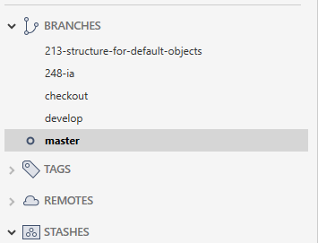
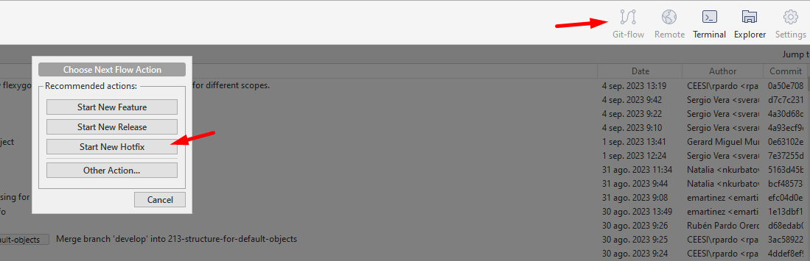
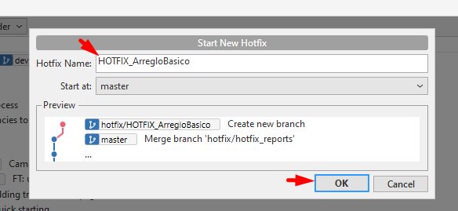
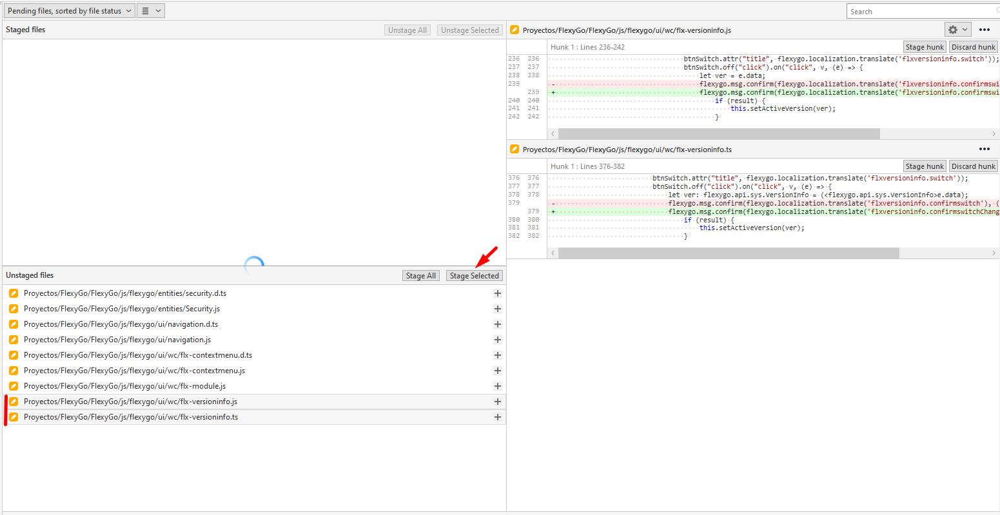
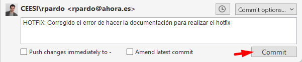
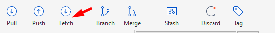
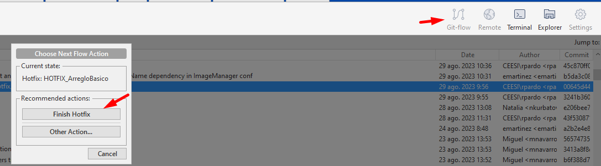
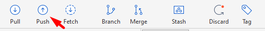

# How do I generate a HOTFIX?

## Full procedure

Before starting the hotfix, we pull `develop` and `master` and make sure we're up to date:

We click **GitFlow > Start new hotfix**

We name the branch starting with `HOTFIX_` (uppercase) followed by a short description that identifies it. We click OK.

We publish the project's databases, set the correct origin, make the fix and download the changes, the same way we would for a new feature.

We review the pending changes and mark the ones that belong to the fix.

We make a commit starting the message with the `HOTFIX:` tag, followed by the description of the fix.

We fetch and check that we have no pending pulls; if we do, we switch to the corresponding branch, pull, and go back to the hotfix branch.

We click **Git Flow > Finish Hotfix**

We push `develop`, switch to `master` and push `master` as well.

