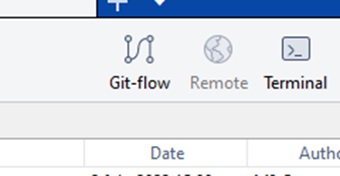
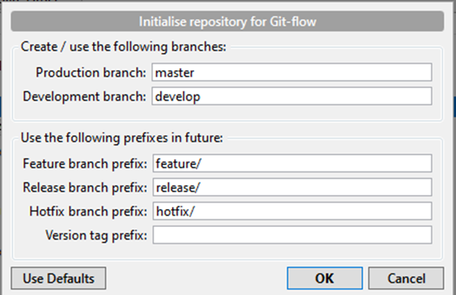
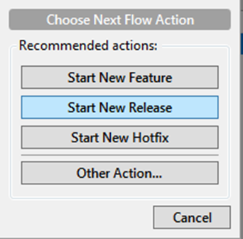
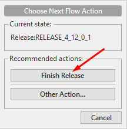
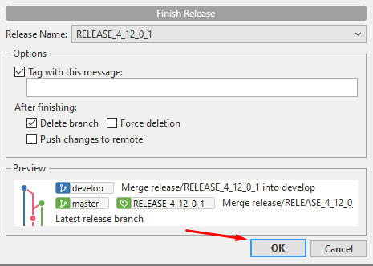
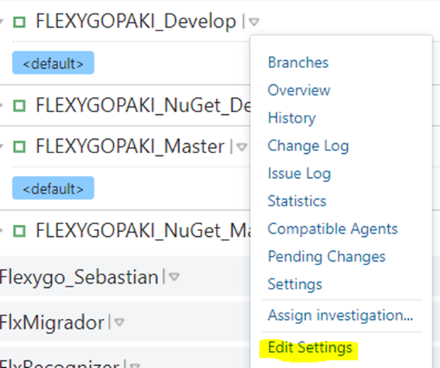
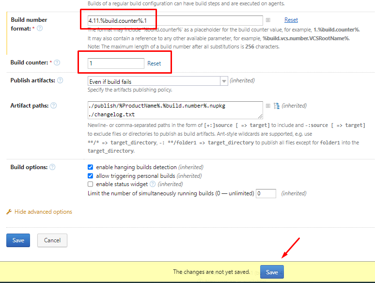
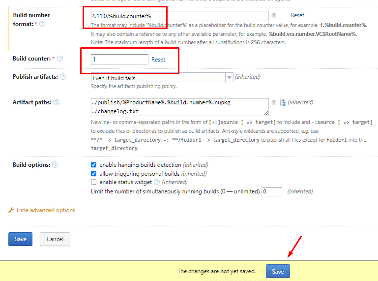

# How do I generate a RELEASE?

## 1. Create the release in SourceTree

Start from the `develop` branch, clean and with no pending changes.

* Click the Git-Flow button

* Confirm the popup screen with OK

* Click Git-Flow again

* Select **Start New Release** and enter a name such as `RELEASE_4_11_0_1`

A new branch is created from `develop`. Run tests and fix any issues on it through normal commits until it's validated.

* Click Git-Flow again and select **Finish Release**

* Confirm the merge into `master` and `develop`, including the corresponding tag

!!! warning "Before pushing"
    Before pushing, the next step on TeamCity must be completed.

## 2. Update the version number in TeamCity

* Go to the `develop` branch project → **Edit settings**

* Change the first two numbers of the **Build Number format** (e.g. from `4.10` to `4.11`) and reset the **Build Counter** to `1`

* Repeat the same process on the `master` branch project → **Edit settings**

* Change the format (e.g. from `4.10.0` to `4.11.0`) and reset the counter

## 3. Back in SourceTree

* Push the pending merges
* Verify that TeamCity builds and publishes correctly
