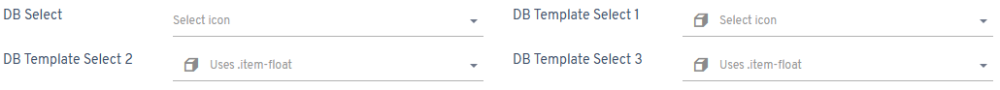
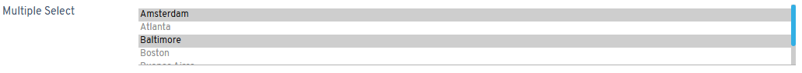
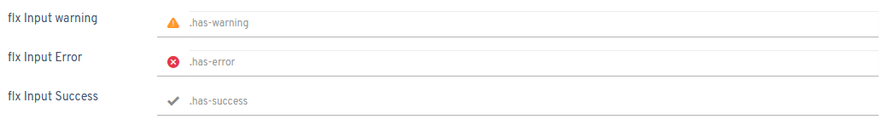
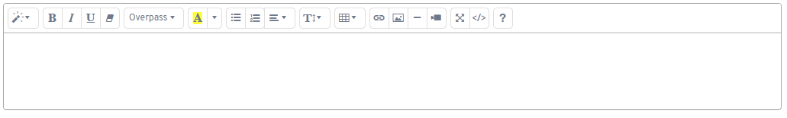

# Controles de formulario

<flx-navbutton class="link" type="openhelpid" helpid="syshelp-controls">Haz clic aquí</flx-navbutton> para probarlos en Flexygo.

## Elementos de formulario por defecto


```html
<flx-text type="text" name="mytext" placeholder="Campo de texto" required requiredmessage="Debe introducir un texto válido"></flx-text>
````

```html
<flx-text type="password" name="password" placeholder="Contraseña" required requiredmessage="Debe introducir una contraseña válida"></flx-text>
```

```html
<flx-textarea name="area" placeholder="Área de texto" required requiredmessage="Debe introducir un texto válido"></flx-textarea>
```

```html
<flx-combo name="select-1" required requiredmessage="Debe introducir un texto válido">
  <option >Ámsterdam<option>
  <option >Atlanta<option>
  <option >Baltimore<option>
</flx-combo>
```

## Números y fechas


```html
<flx-text type="date" name="date" placeholder="Campo de fecha" required requiredmessage="Debe introducir una fecha válida"></flx-text>
```

```html
<flx-text type="datetime-local" name="datetime" placeholder="Campo de fecha y hora" required requiredmessage="Debe introducir una fecha y hora válidas"></flx-text>
```

```html
<flx-text type="time" name="time" placeholder="Campo de hora" required requiredmessage="Debe introducir una hora válida"></flx-text>
```

```html
<flx-text type="number" name="number" placeholder="Número" required requiredmessage="Debe introducir un número válido"></flx-text>
```

```html
<flx-text type="number" decimalplaces="2" name="decimal" placeholder="Número decimal" required requiredmessage="Debe introducir un número decimal válido"></flx-text>
```

## Campos especiales


```html
<flx-text type="tel" iconclass="flx-icon icon-phone" name="telephone" placeholder="Número de teléfono" required requiredmessage="Debe introducir un teléfono"></flx-text>
```

```html
<flx-text type="email" iconclass="flx-icon icon-web" name="email" placeholder="Correo electrónico" required requiredmessage="Debe introducir un email válido"></flx-text>
```

```html
<flx-text type="url" iconclass="flx-icon icon-internet" name="url" placeholder="Dirección URL" required requiredmessage="Debe introducir una URL válida"></flx-text>
```

```html
<flx-text type="color" iconclass="flx-icon icon-custom" name="color" placeholder="Seleccione un color" required requiredmessage="Debe seleccionar un color"></flx-text>
```

```html
<flx-text type="map" name="coordinates" placeholder="Coordenadas"></flx-text>
```

```html
<flx-whiteboard property="whiteboard" style="height:100px" name="white board" placeholder="Pizarra"></flx-whiteboard>
```

## Editores de código


Utilice el editor flx-code en cualquiera de estos tres tipos establecidos: htmlcode, javacode o sqlcode. El flx-code se ajusta al tamaño del div que lo contiene.

```html
<flx-code type="htmlcode"></flx-code>
```

## Casillas de verificación y botones de opción


```html
<label class="control-label txt-outstanding">Checkbox 1</label><br>
<flx-check name="check1" class="txt-outstanding" checked></flx-check>
<label class="control-label txt-danger">Checkbox 2</label><br>
<flx-check name="check2" class="txt-danger" checked></flx-check>
<label class="control-label txt-warning">Checkbox 3</label><br>
<flx-check name="check3" class="txt-warning" checked></flx-check>
```

```html
<label class="control-label">Checkbox 1</label>
<flx-check name="check1" checked></flx-check>
<label class="control-label">Checkbox 2</label>
<flx-check name="check2" checked></flx-check>
<label class="control-label">Checkbox 3</label>
<flx-check name="check3" checked></flx-check>
```


```html
<flx-radio name="radio1" class="txt-outstanding">
  <option value="1">Opción 1<option>
  <option value="2">Opción 2<option>
  <option value="3">Opción 3<option>
</flx-radio>
```

```html
<flx-radio name="radio2" class="txt-info inline">
  <option value="1">Opción 1<option>
  <option value="2">Opción 2<option>
  <option value="3">Opción 3<option>
</flx-radio>
```


```html
<flx-radio name="radio1" class="txt-warning" multiple separator=";" value="1;2">
  <option value="1">Opción 1<option>
  <option value="2">Opción 2<option>
  <option value="3">Opción 3<option>
</flx-radio>
```

```html
<flx-radio name="radio1" class="txt-danger inline" multiple separator=";" value="opción 1;opción 2">
  <option>Opción 1<option>
  <option>Opción 2<option>
  <option>Opción 3<option>
</flx-radio>
```

## Checkbox anulable (tres estados)


```html
<label class="control-label txt-outstanding">Checkbox anulable</label><br>
<flx-check name="check1" allowNull class="txt-outstanding" checked></flx-check>
```

## Interruptores


```html
<flx-switch></flx-switch>
<flx-switch checked></flx-switch>
<flx-switch class="switch-danger"></flx-switch>
<flx-switch checked class="switch-danger"></flx-switch>
```

```html
<flx-switch class="inline"></flx-switch>
<flx-switch class="inline" checked></flx-switch>
<flx-switch class="inline switch-danger"></flx-switch>
<flx-switch checked class="inline switch-danger"></flx-switch>
```

## Selector de base de datos (DB Select)



```html
<flx-dbcombo ObjectName="sysObject" PlaceHolder="Seleccionar icono" iconclass="flx-icon icon-object" ViewName="iconsView" SQLValueField="IconName" SQLDisplayField="IconName" additionalWhere="" required requiredmessage="Debe introducir un teléfono"></flx-dbcombo>
```

```html
<flx-dbcombo ObjectName="sysObject" PlaceHolder="Seleccionar icono" iconclass="flx-icon icon-object" ViewName="iconsView" SQLValueField="IconName" SQLDisplayField="IconName" additionalWhere="" required requiredmessage="Debe introducir un email válido">
  <template>
    <div><i class="{{CssClass}} icon-lg icon-margin-right"></i>{{IconName}}</div>
  </template>
</flx-dbcombo>
```

```html
<flx-dbcombo class="item-float" ObjectName="sysObject" PlaceHolder="Usa .item-float" iconclass="flx-icon icon-objectt" ViewName="iconsView" SQLValueField="IconName" additionalWhere="" SQLDisplayField="IconName" required requiredmessage="Debe introducir una URL válida">
  <template>
    <i class="txt-outstanding {{CssClass}} icon-2x icon-margin" title="{{IconName}}"></i>
  </template>
</flx-dbcombo>
```

```html
<flx-dbcombo class="item-float" ObjectName="sysObject" PlaceHolder="Usa .item-float" iconclass="flx-icon icon-object" ViewName="iconsView" SQLValueField="IconName" additionalWhere="" SQLDisplayField="IconName" required requiredmessage="Debe seleccionar un color">
  <template>
    <div class="icon-box-s">
      <div class="icon-margin">
        <i class="{{CssClass}} icon-lg icon-zoom"></i>
      </div>
      <div>{{IconName}}</div>
    </div>
  </template>
</flx-dbcombo>
```

## Multiselección de base de datos (DB Multi Select)


```html
<flx-multicombo ObjectName="sysObject" additionalWhere="" PlaceHolder="Seleccionar icono" iconclass="flx-icon icon-icons" ViewName="iconsView" SQLValueField="IconName" SQLDisplayField="IconName" required requiredmessage="Debe introducir un email válido">
  <template>
    <div><i class="{{CssClass}} icon-lg icon-margin-right"></i>{{IconName}}</div>
  </template>
</flx-multicombo>
```

## Selección múltiple



```html
<flx-combo name="m-1" multiple separator=";" required requiredmessage="Debe introducir un texto válido" value="Ámsterdam;Baltimore">
  <option>Ámsterdam<option>
  <option>Atlanta<option>
  <option>Baltimore<option>
</flx-combo>
```

## Etiquetas


```html
<flx-tag name="tag-1" separator=";" required requiredmessage="Debe introducir un texto válido" value="Framework;Flexygo;Freeware"></flx-tag>
```

```html
<flx-tag name="tag-2" separator=";" required requiredmessage="Debe introducir un texto válido" value="bueno;malo">
  <option>bueno<option>
  <option>malo<option>
  <option>feo<option>
</flx-tag>
```

```html
<flx-tag name="tag-3" class="size-l" iconclass="flx-icon icon-tag" separator=";" required requiredmessage="Debe introducir un texto válido" value="Framework;Flexygo;Freeware"></flx-tag>
```

## Estados de entrada



```html
<flx-text type="text" iconclass="flx-icon icon-warning" name="warning" placeholder=".has-warning" required requiredmessage="Debe introducir un texto"></flx-text>
```

```html
<flx-text type="text" iconclass="flx-icon icon-close" name="error" placeholder=".has-error" required requiredmessage="Debe introducir un texto válido"></flx-text>
```

```html
<flx-text type="text" iconclass="flx-icon icon-accepted" name="success" placeholder=".has-success" required requiredmessage="Debe introducir un texto válido"></flx-text>
```

## Tamaños de entrada


```html
<flx-text class="size-xs" type="text" name="mytext" placeholder=".size-xs" required requiredmessage="Debe introducir un texto válido"></flx-text>

<flx-text class="size-s" type="text" name="mytext" placeholder=".size-s" required requiredmessage="Debe introducir un texto válido"></flx-text>

<flx-text type="text" name="mytext" placeholder=".size-ms (Entrada por defecto)" required requiredmessage="Debe introducir un texto válido"></flx-text>

<flx-text class="size-l" type="text" name="mytext" placeholder=".size-l" required requiredmessage="Debe introducir un texto válido"></flx-text>
```

## Editor HTML



El módulo Editor HTML utiliza el componente web flx-htmledit. Puede añadir su Editor HTML referenciando el módulo Editor HTML.

```html
<flx-htmledit></flx-htmledit>
```

## Imagen


```html
<flx-image TypeMode="file" rootpath="~/ruta/"></flx-image>
<flx-image TypeMode="base64"></flx-image>

<flx-image ........... defaultvalue="valorRuta/valorBase64"></flx-image>
<flx-image ........... value="primerValor"></flx-image>
```

## Subida de archivos


```html
<flx-upload Type="file" rootpath="~/ruta/"></flx-upload>
<flx-upload Type="base64"></flx-upload>

<flx-upload ........... value="valorRuta/valorBase64"></flx-upload>
```

## Dependencias de controles personalizados

Uso de dependencias para cambiar el tipo de control de una propiedad dependiente. Puede usar dependencias entre propiedades para cambiar el tipo de control de la propiedad dependiente. Antes de crear la dependencia debe crear uno o más controles personalizados, que serán los que asignará a la propiedad dependiente.

* **Establecer control personalizado según los valores de la propiedad padre**: Primero elegirá los valores para los cuales cambiará la propiedad dependiente y, en el combo, seleccionará el control personalizado correspondiente.


* **Establecer el control personalizado mediante una sentencia SQL**: En este caso, será la sentencia SQL la que establezca el control personalizado de la propiedad dependiente. La sentencia SQL debe devolver el nombre del control personalizado.

