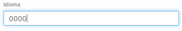
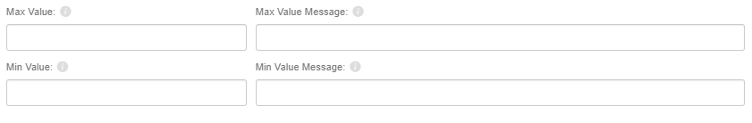

# Validadores de Formulario

Al diseñar o configurar una pantalla de inserción o modificación de datos, será necesario validar los datos ingresados por el usuario antes de permitirle guardar la información. Los validadores evitarán que se guarde la información, si es incorrecta o no cumple con los requisitos que establecemos. 

Existen varios tipos y niveles de validación:

## Basado en la especificación del modelo de datos

La información ingresada en cada campo debe ser del tipo y rango soportados por el diseño de la base de datos.

## Basado en el tipo de control

El tipo de control elegido al diseñar la pantalla de edición puede tener sus propias validaciones que impiden al usuario ingresar valores incorrectos, un campo numérico evitará que el usuario ingrese otros caracteres que no sean numéricos, un campo de tipo fecha solo permitirá fechas correctas, un campo de tipo correo validará que el texto corresponda a una cuenta de correo válida, un campo de tipo texto solo admitirá el número máximo de caracteres establecido en la definición de la base de datos.

_Ejemplos:_

El control de fecha nos impedirá ingresar un mes 13, o un día 32:

En el caso de un campo de texto limitado a 4 caracteres, impedirá que el usuario añada más caracteres.

## Basado en propiedades de control

### Campo Requerido

Esta validación se puede especificar tanto a nivel de base de datos al diseñar nuestras tablas y campos como a nivel de diseño de formularios.

*   **Es Requerido**: Con esta opción será obligatorio que el usuario complete el campo.
*   **Mensaje de Requerido**: Podemos personalizar el mensaje de validación que aparecerá en el formulario cuando el usuario intente guardar y no haya completado la información requerida.

### Valores mínimos y máximos

Esta validación se puede utilizar para campos numéricos.

*   **Max Value**: In numerical fields we can set a maximum value.
*   **Max Value Message**: Personalized message that will indicate the user that the value exceeds maximum allowed.
*   **Min Value**: In numerical fields we can set a maximum value.
*   **Min Value Message**: Personalized message that will indicate the user that the value exceeds maximum allowed.

### Expresión Regular

Podemos establecer una validación del contenido del campo a través de expresiones regulares.

*   **Expresión regular**: Expresión regular que verificará el contenido del campo.
*   **Texto**: Mensaje personalizado para indicar al usuario que el valor ingresado no cumple con las condiciones de la expresión regular.

## Validador de sentencias SQL

Expresión SQL que debe devolver necesariamente 0 o 1. Si devolvemos 0, indicaremos que el valor no es admitido y si indicamos 1, el valor es admitido.

Podemos construir la sentencia SQL utilizando contextVars y propiedades del propio objeto, ya que la plataforma las analizará antes de ejecutar la sentencia. A través de estas frases (tan simples o complejas como necesitemos) notificaremos al usuario que la información no cumple con los criterios definidos. Por otro lado, optimizaremos nuestros procesos, ya que estamos evitando ejecuciones de inserción/actualización o la ejecución de storeds o triggers que devuelven un error o incluso generan bloqueos o transacciones innecesarias.

_Ejemplo:_

