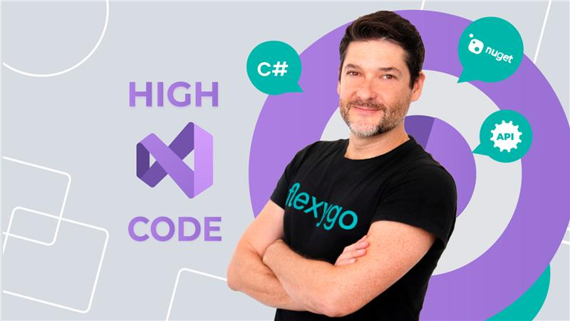

# Cursos

Queremos presentarte los cursos de **Flexygo** alojados en la plataforma [Udemy](https://www.udemy.com/).
Nuestro equipo crea cursos especialmente para esta plataforma, para que tengas acceso constante a un curso de **Flexygo** bien estructurado en cualquier momento y desde cualquier lugar.

Echa un vistazo a los cursos que ya tenemos:

## Flexygo low code

Sumérgete en el mundo del low-code con **Flexygo** y prepárate para las herramientas de desarrollo del futuro.

En este curso, adquirirás conocimientos básicos de **Flexygo**. Al finalizar, podrás crear tu propia aplicación.

* **Creado por:** Daniel Lutz
* **Duración:** 5 horas en total · 54 lecciones · Todos los niveles · Acceso completo de por vida

[Ir al curso](https://www.udemy.com/course/flexygo-low-code/){ .button }

## Flexygo low code – Aplicaciones Offline

Desarrolla tus propias aplicaciones offline para smartphones y tablets (iOS y Android).

Durante el curso crearemos una app utilizando un caso práctico de principio a fin. Servirá como proyecto de aprendizaje.

* **Creado por:** Daniel Lutz
* **Duración:** 2.5 horas en total · 28 lecciones · Todos los niveles · Acceso completo de por vida

[Ir al curso](https://www.udemy.com/course/flexygo-low-code-offline-apps/){ .button }

## Flexygo high code

Rompe los límites del low-code y lleva tu proyecto Flexygo al siguiente nivel. Con Flexygo, todo es posible.

Durante el curso aprenderemos a desarrollar una aplicación Flexygo utilizando el entorno de desarrollo Visual Studio.

* **Creado por:** Daniel Lutz
* **Duración:** 3.0 horas en total · 311 lecciones · Nivel Desarrollador · Acceso completo de por vida

[Ir al curso](https://www.udemy.com/course/flexygo-high-code/){ .button }

## Flexygo AI Lowcode

Aprende a integrar inteligencia artificial conversacional en tus aplicaciones sin necesidad de programar.

Configura agentes de IA en Flexygo para redactar textos, responder preguntas o generar código a partir de formularios de la aplicación.

* **Creado por:** Daniel Lutz
* **Duración:** 1.25 horas en total · 40 lecciones · Nivel Desarrollador · Acceso completo de por vida

[Ir al curso](https://www.udemy.com/course/flexygo-agentes-de-ia/){ .button }

## **¡Mantente atento!**

**Nuevos cursos disponibles próximamente...**